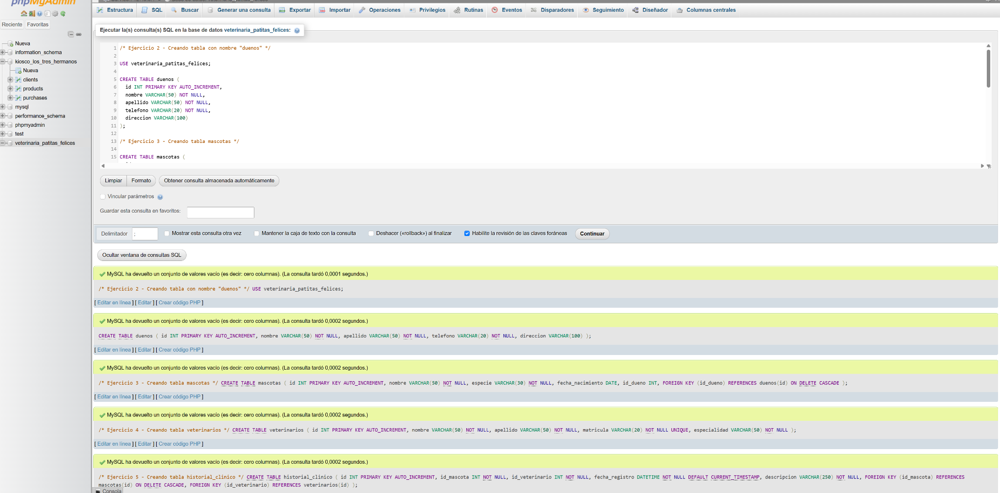
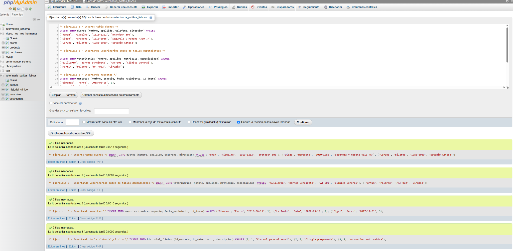
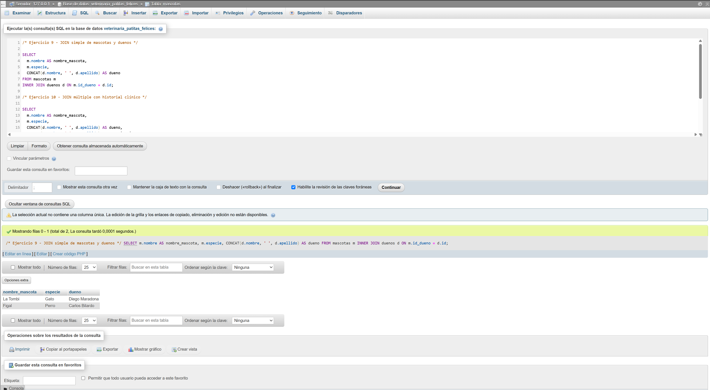
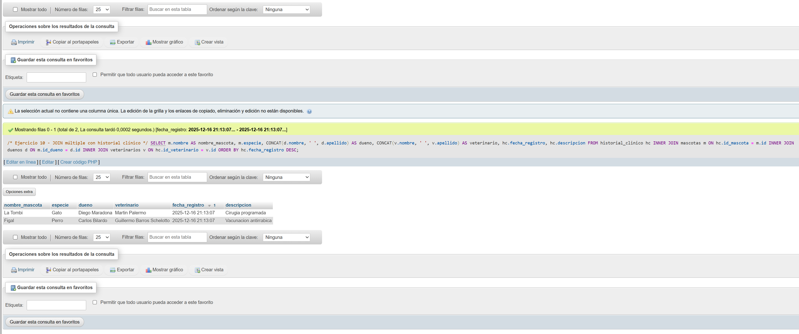

# 🐾 Trabajo Práctico MySQL – Veterinaria *Patitas Felices*

Proyecto realizado como **trabajo práctico de MySQL** para la materia de **Backend / Bases de Datos**.

El objetivo del TP es **diseñar, crear y consultar una base de datos relacional** utilizando SQL, aplicando:

- Creación de tablas  
- Claves primarias y foráneas  
- Relaciones entre entidades  
- Consultas con `SELECT`, `JOIN`, `WHERE`, etc.

---

## 📂 Estructura del proyecto

```bash
.
├── sql/
│   ├── 01_create_db.sql      # Creación de la base de datos
│   ├── 02_tables.sql         # Creación de TODAS las tablas
│   ├── 03_inserts.sql        # Inserción de datos de prueba
│   ├── 04_updates.sql        # Actualización de registros
│   ├── 05_deletes.sql        # Eliminación de registros
│   └── 06_joins.sql          # Consultas con JOIN
├── screenshots/              # Capturas de ejecución en phpMyAdmin
└── README.md
```md

> ⚠️ **Importante:** todas las tablas fueron creadas dentro de un **único script** (`02_tables.sql`), tal como se solicita en la consigna.

---

## 🧠 Modelo de datos

La base de datos representa el funcionamiento de una veterinaria:

* 🐶 **Mascotas**
* 👤 **Dueños**
* 🩺 **Veterinarios**
* 📋 **Historial clínico**

Las tablas están relacionadas mediante **claves foráneas**, respetando la integridad referencial.

---

## ▶️ Cómo ejecutar los scripts

Los scripts deben ejecutarse **en orden**, desde MySQL Workbench o la terminal.

### Opción 1: MySQL Workbench

1. Abrir **MySQL Workbench**
2. Conectarse al servidor MySQL
3. Abrir cada archivo `.sql`
4. Ejecutarlos en el siguiente orden:

```sql
01_create_db.sql
02_tables.sql
03_inserts.sql
04_updates.sql
05_deletes.sql
06_joins.sql
```

---

### Opción 2: Terminal (MySQL CLI)

```bash
mysql -u root -p
```

Luego:

```sql
SOURCE ruta/sql/01_create_db.sql;
SOURCE ruta/sql/02_tables.sql;
SOURCE ruta/sql/03_inserts.sql;
SOURCE ruta/sql/04_updates.sql;
SOURCE ruta/sql/05_deletes.sql;
SOURCE ruta/sql/06_joins.sql;

```

---

## 📸 Capturas de pantalla

A continuación se muestran algunas capturas del proyecto en MySQL Workbench:

### ✔️ Creación de la base de datos

 

### ✔️ Creación de tablas



### ✔️ Inserción de datos



### ✔️ Consultas con JOIN




---

## 🧪 Ejemplos de consultas

```sql
SELECT
  m.nombre AS nombre_mascota,
  m.especie,
  CONCAT(d.nombre, ' ', d.apellido) AS dueno
FROM mascotas m
INNER JOIN duenos d ON m.id_dueno = d.id;
```

---

## 🛠️ Tecnologías utilizadas

* 🐬 **MySQL**
* 🧰 **MySQL Workbench**
* 💻 **SQL**

---

## ✍️ Autor

**Matías Castells**
Trabajo práctico académico – sin fines comerciales

---

⭐ Si este repositorio te resultó útil, ¡no olvides dejar una estrella!
